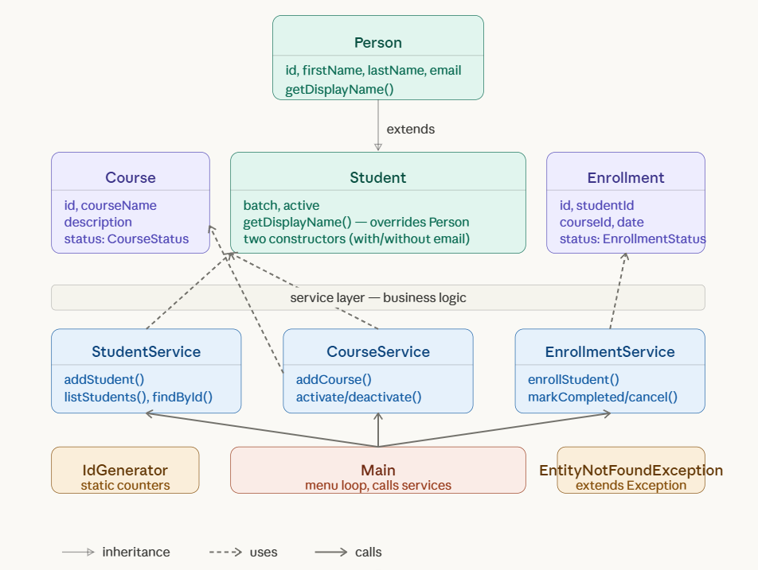

# LearnTrack - Student & Course Management System

## Project Description
LearnTrack is a menu-based console application built in Core Java to manage
students, courses and enrollments.

### Features
**Student Management**
- Add, view, search and deactivate students

**Course Management**
- Add, view, activate and deactivate courses

**Enrollment Management**
- Enroll students in courses, view enrollments,
  mark as completed or cancel

## Tech Stack
- Java 25.0.2
- Core Java — OOP principles (encapsulation, inheritance, polymorphism)
- Collections — ArrayList for in-memory storage
- Console-based UI with Scanner

## Project Structure
```
src/com/airtribe/learntrack/
├── entity/       - Person, Student, Course, Enrollment
├── repository/   - Data storage layer
├── service/      - Business logic layer
├── exception/    - Custom exceptions
├── util/         - IdGenerator, InputValidator
├── constants/    - MenuOptions, AppConstants
└── enums/        - EnrollmentStatus, CourseStatus
```

## How to Run
1. Open project in IntelliJ IDEA
2. Run `com.airtribe.learntrack.Main`

## Class Diagram
