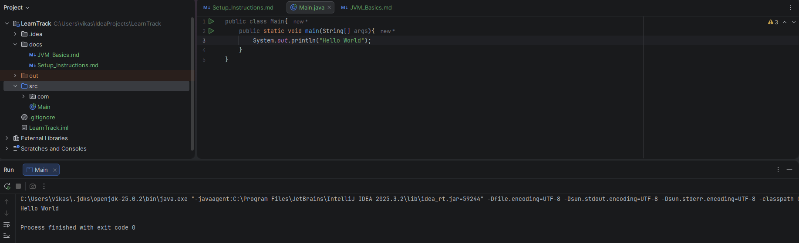

# Setup Instructions

## JDK Version
Java 25.0.2 (LTS)

## Hello World
Created and ran a simple Hello World program in IntelliJ IDEA.

How to Compile and Run
- Open Project in IntelliJ IDEA
- Run Main.java using green play buttom
- Or via terminal: javac Main.java and java Main